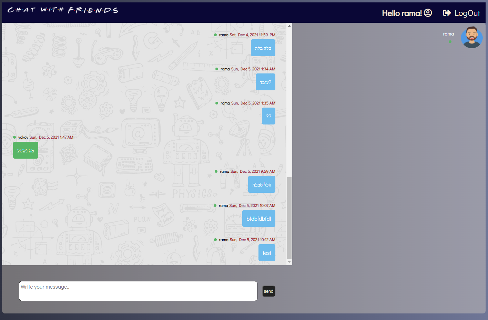
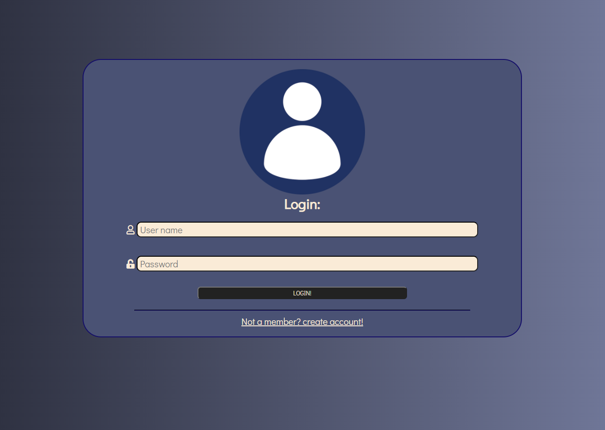
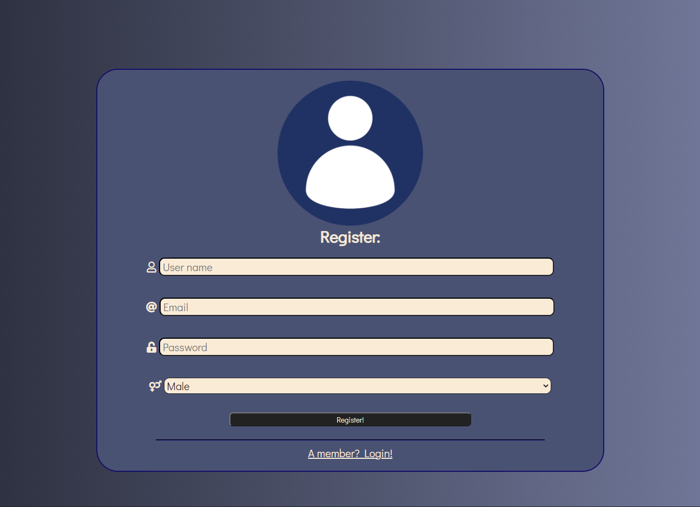

# Chat room task

### A chat room app Which rely on [SSE](https://ably.com/topic/server-sent-events)

---

### Development -

#### Persistance - 🏆

- All users are saved in MongoDB so you can connect to the same user several times.
- All messages are saved in MongoDB so a user can see the history of the messages that happened while a user was logged out.

#### Live - 👨‍💻👩‍💻

- All logged in users will receive the message sent live.
- When a user logs in or logs out all users except him will see a message about it in the chat.

#### Authentication - 🤷‍♀️🤷‍♂️

- Each user who logs in will receive an access-token 'expired within an hour and a refresh-token that he can use to restore the token within 24 hours of logging in, after which he will have to reconnect.
- A valid token is required to: Send messages and receive information about users and messages from history.

#### Security - ⛔

- Encrypted passwords
- Offline user can not access chat room

---

### User Instructions -

#### ✅📃 Register form -

- The user will be saved and you can connect to it whenever you want.
- You need to enter valid email, gender, strong password and valid username

#### ✅🔓 Login form -

- You can log in with a username and password.

#### ✅💬 Chat room -

**There is a nice design where**

- All the connected users are listed on the right with pics by their gender
- The call appears in the center - messages sent from you will appear on the right and in light blue and messages from other chat friends will appear in green on the left.
- At the bottom you can write and send with the click of a button.

---

### Known bugs -

- User disconnection and login The list of participants is not updated live.
- When there is no movement for 4.5 seconds the connection is disconnected and renewed (EventSource thing ....)

---

#### Pics -

---

## Bonus:

- [x] Use jwt To assign a token to a user.

2. Create auth middleware and check the token before you allow the user to enter the chat room
3. Use private route to redirect a user without a valid token.

- [x] When a user enters a chat room he will get the message history of the room.

5. Clicking on a username sends a message only to it specifically
6. Gray _V_ when the message successfully reached the server. 2 gray _V_ when the message reached all participants.
7. Do only after all the other bonuses - create different rooms and option to be admin of a room.
